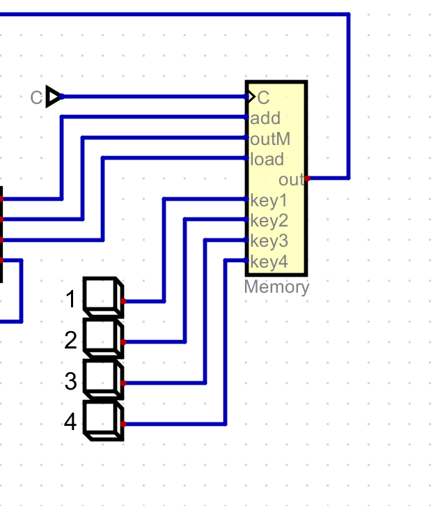

Consulta de los diferentes conceptos

1. CPU(Central Processing Unit)

La CPU es el componente principal de un sistema informático, responsable de ejecutar instrucciones y procesar datos, es el que coordina todas las operaciones y gestiona la comunicación entre los diferentes componentes.

2. ALU(Arithmetic Logic Unit)

La ALU es una parte de la CPU que realiza operaciones aritméticas (como suma, resta, multiplicación y división) y operaciones lógicas (como AND, OR, NOT). Es fundamental para el procesamiento de datos y la ejecución de instrucciones

3. Registros:

Los registros son pequeñas áreas de almacenamiento dentro de la CPU que se utilizan para guardar temporalmente datos e instrucciones.

a. De propósito general

Son registros que pueden usarse para cualquier operación que requiera la CPU. Permiten la manipulación de datos durante el procesamiento.

b. Específicos: 

Program Counter: Registra la dirección de la siguiente instrucción que debe ejecutarse. Se incrementa automáticamente después de cada instrucción.

Stack Pointer: Apunta a la parte superior de la pila (stack) en memoria, que se utiliza para gestionar las llamadas a funciones y almacenar datos temporales.

4. Unidad de control

La unidad de control es parte de la CPU que dirige el funcionamiento de la computadora. Interpreta las instrucciones de la memoria, envía señales a otros componentes y coordina las operaciones de la ALU, los registros y la memoria.

5. Buses de datos y de dirección

Buses de datos: Transporta los datos entre la CPU, la memoria y otros dispositivos. Su ancho (número de bits) determina cuántos datos se pueden transferir simultáneamente.

Bus de dirección: Lleva la información sobre dónde se encuentran los datos en la memoria. El ancho del bus de dirección determina la cantidad de memoria que puede ser direccionada.   

6. Memoria RAM y memoria ROM. ¿Son vigentes aún esos términos?x

Memoria RAM: Memoria volátil utilizada para almacenar datos temporales mientras la computadora está encendida. Es fundamental para el rendimiento del sistema.

Memoria ROM: Memoria no volátil que contiene datos permanentes, como el firmware. Se usa para almacenar instrucciones que no cambian, incluso cuando la computadora está apagada.

Hay nuevas tecnologías (como la memoria flash) que se utilizan en lugar de ROM en muchos dispositivos, aunque aun es vigente la memoria ROM.

7. Opcode 

Es una parte de la instrucción que indica a la CPU qué operación debe realizar. Cada instrucción tiene un opcode que la identifica y define su función (por ejemplo, sumar, restar, cargar datos, etc.).

Interación de los componentes

La CPU 

La CPU con ayuda del Pc manda a buscar una instrucción en una dirección.

La ROM

Busca la dirección donde se encuentra esta instrucción y manda su contenido a los decodificadores.

los decodificadores traducen la instrucción a lenguaje máquina para ser interpretado y por último ejecutado

La memory

La memory tiene un circuito interno que hace posible que el teclado active la pantalla y modifique los pixeles para así volverlos negros al mantener sostenida cada tecla

Conceptos de un programa

1. ¿Qué es un programa y dónde se almacena?

Un programa es un conjunto de instrucciones que le indica a un computador cómo realizar una tarea específica.

Se almacena en un dispositivo de almacenamiento, como un disco durp estado sólido o en la memoria de un dispositivo, dependiendo de si está en ejecución o no.

2. Si pongo un comentario en un programa como: //variable tipo contador. ¿Dónde se almacena dicho comentario?

No se almacenan en ningún lado del programa ejecutable, solo en el disco duro o código funete.

3. ¿Donde se almacena una variable?

Se alamacena en la memoria RAM durante su ejecución del programa.

Proceso FETCH-DECODE-EXECUTE

Este proceso se basa en la busqueda de instrucciones, posteriormente se traduce al lenguaje que la máquina entiende y por último ejecuta esta instrucción